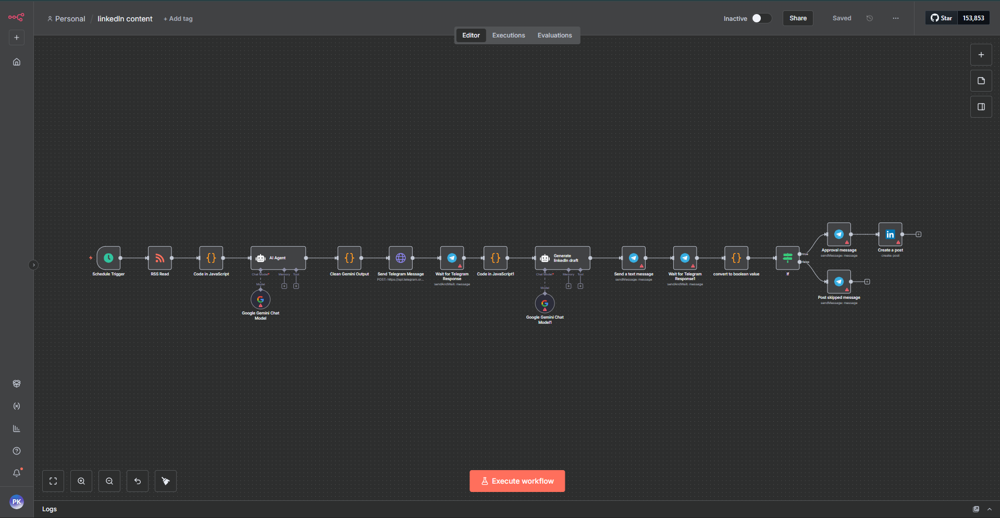

# 🧠 LinkedIn Content Generator (v1)

Automated LinkedIn post creation pipeline using **n8n**, **Google Gemini**, and **Telegram Bot**.

---

## 🚀 Overview
This workflow automates your content generation for LinkedIn:
- Fetches trending AI news via RSS  
- Sends summarized options to Telegram  
- Lets you choose a topic  
- Generates a full LinkedIn-style draft using Gemini  
- Allows approve/skip from Telegram  
- Auto-publishes approved posts to LinkedIn  

---

## 🧩 Workflow Components

| Stage | Description |
|-------|--------------|
| **1. RSS Feed Reader** | Pulls latest AI news articles from Google News |
| **2. Gemini Agent** | Summarizes and ranks the top 6 articles |
| **3. Telegram Bot** | Sends options, captures user input and approval |
| **4. Draft Generator** | Creates LinkedIn-ready posts in a conversational style |
| **5. LinkedIn API** | Publishes approved drafts automatically to your profile |

---

## ⚙️ Setup Instructions

### 1️⃣ Import Workflow
1. Open [n8n.io](https://app.n8n.io)
2. Create a new workflow
3. Click **Import** → Upload  
   `LinkedIn content generator.json`

---

### 2️⃣ Configure Credentials

You will need:
- **Telegram Bot Token** (from [@BotFather](https://core.telegram.org/bots))
- **Google Gemini (PaLM) API Key**
- **LinkedIn OAuth2 API Connection**

Once all credentials are added in n8n, test them individually.

---

### 3️⃣ Run Workflow
1. Trigger manually or schedule using **Schedule Trigger**
2. Telegram will send 6 trending AI topics with summaries  
3. Reply with the number (1–6) to pick one
4. Gemini will generate a LinkedIn draft
5. Approve ✅ to post, or ❌ to skip
6. Approved posts are queued and auto-posted to LinkedIn

---

## 📸 Example Output

### 🪄 Step 1: Telegram Topic Suggestions  
Bot lists 6 trending AI news headlines with summaries.

---

### ✍️ Step 2: AI-Generated Draft + Approval via Telegram  
Gemini writes a LinkedIn-style post and asks for approval.

---

### ⚙️ Workflow Preview  
A clean composite view of the Telegram workflow and Gemini stages.

---

## 🧠 Tools Used
- [n8n.io](https://n8n.io/) – Workflow automation  
- [Google Gemini](https://ai.google.dev/) – Content generation  
- [Telegram Bot API](https://core.telegram.org/bots/api) – User interaction  
- [LinkedIn API](https://learn.microsoft.com/en-us/linkedin/) – Auto-posting  

---

## 🧩 Future Enhancements
- Multi-post scheduling  
- Engagement analytics (views / likes / clicks)  
- Tone presets (Professional / Casual / Storytelling)  
- Support for multiple LinkedIn pages  

---

## 👨‍💻 Author
**Pratik Kumar Jha**  
Built with ❤️ using **automation + AI**

---

## ⚖️ License
This project is released under the MIT License.  
Feel free to use, fork, and improve with credit.
